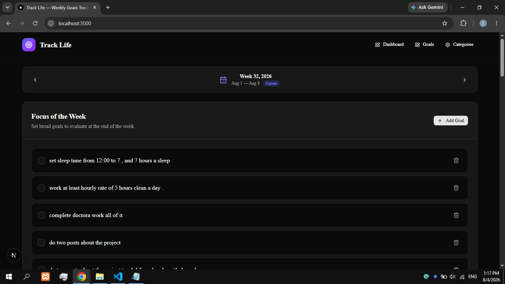
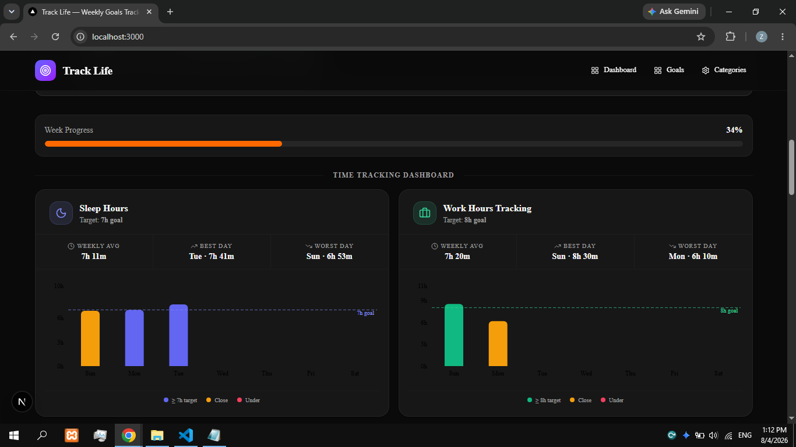
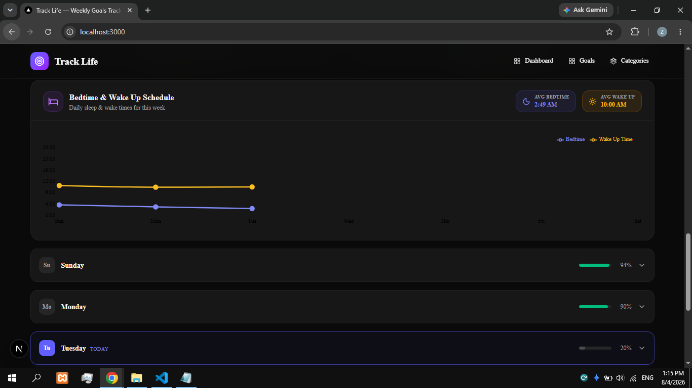
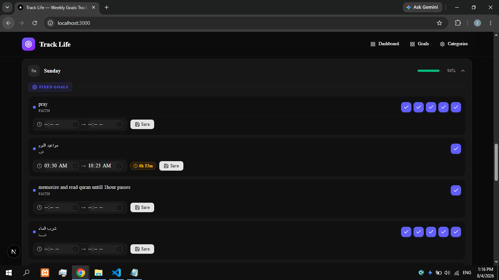

# Track Life

**Track Life** is a personal productivity web application that helps you track the parts of your life that matter most. Monitor daily tasks, weekly goals, work hours, sleep, habits, and personal productivity metrics — all in one place.

## Why I Built It

Everyone wants to be more productive and take control of their life, but many people struggle with procrastination. One reason is a lack of clarity. It's difficult to improve something you don't measure.

I realized I couldn't answer simple questions about my own life:

How many hours do I actually work each day?
- Am I sleeping enough?
- Am I building good habits or repeating bad ones?
- Where is my time really going?

So I built Truck Life—first and foremost for myself.

The goal wasn't just to create another to-do list. I wanted a system that could give me real data about how I spend my time. Once you have accurate numbers, your decisions become based on facts instead of assumptions.

## Philosophy

This app doesn't promise to fix your life for you. It shows you the truth. When you can clearly see your habits, sleep, productivity, and streaks, you naturally make better decisions.

## Features

- Track daily task completion and occurrences
- Define and monitor weekly goals
- Record and analyse sleep duration and schedule
- Track work hours and time blocks
- Habit tracking with streaks (good and bad habits)
- Productivity & trend charts
- CRUD for categories, goals, weeks, day goals, completions
- Simple REST API (Express + Prisma)

## Screenshots

Main dashboard and weekly views — screenshots taken from the app 






## Tech Stack

- Frontend: Next.js (React 19), Tailwind CSS, shadcn components, Recharts
- Backend: Node.js, Express
- ORM: Prisma (PostgreSQL datasource)
- Database: PostgreSQL (configured via `DATABASE_URL`)
- Dev tooling: ESLint, PostCSS, Tailwind

Key packages (see package.json files):

- `frontend`: `next`, `react`, `tailwindcss`, `recharts`, `shadcn`
- `backend`: `express`, `prisma`, `@prisma/client`, `pg`, `dotenv`, `zod`

## Installation (local)

Prerequisites:

- Node.js (v18+ recommended)
- PostgreSQL (or a compatible provider) and a `DATABASE_URL`

1. Clone the repo and open two terminals.

Backend setup:

```bash
cd backend
npm install
# create a .env with your DATABASE_URL and other vars
# generate Prisma client and push schema to DB
npx prisma generate
npx prisma db push
# seed the DB (if needed)
npx prisma db seed
npm run dev
```

Frontend setup:

```bash
cd frontend
npm install
npm run dev
# open http://localhost:3000
```

By default the backend listens on `PORT` (default: `3001`). Point the frontend API base to the backend, for example:

- `NEXT_PUBLIC_API_URL=http://localhost:3001/api`

## Environment variables

At minimum configure the following for local development (create a `backend/.env`):

- `DATABASE_URL` — PostgreSQL connection string
- `PORT` — backend port (optional; default 3001)

Frontend environment variables (optional):

- `NEXT_PUBLIC_API_URL` — full URL to the backend API (e.g. `http://localhost:3001/api`)


